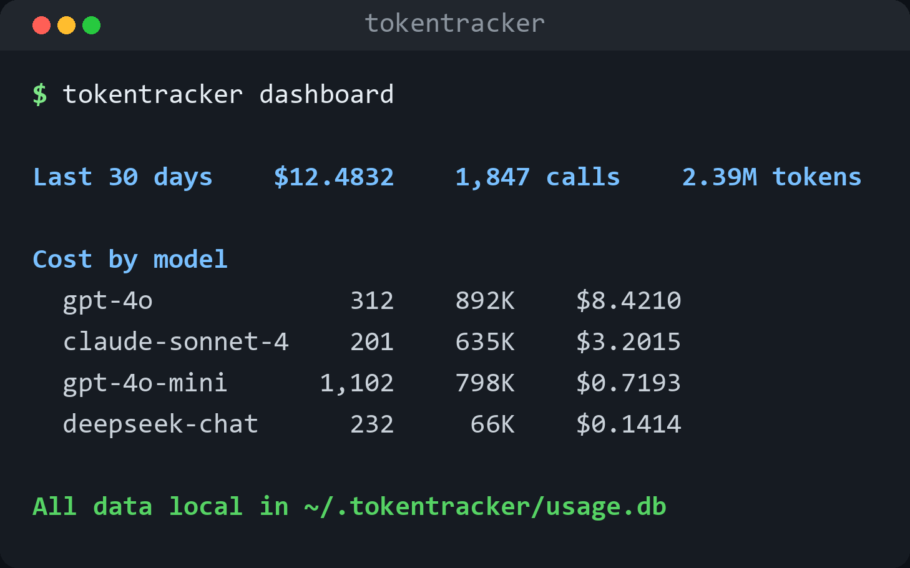

<div align="center">


Every API call logged. Every dollar tracked. Zero configuration.

[](LICENSE)
[](https://www.python.org/downloads/)
[](https://github.com/he-yufeng/TokenTracker/actions)

**[English](README.md) · [中文](README_CN.md)** &nbsp;·&nbsp; [Quick Start](#quick-start) · [Why?](#why-tokentracker) · [Usage](#usage)

</div>

<p align="center"></p>

---

## The Problem

You're building with LLMs. You have no idea how much you're spending. Your OpenAI bill arrives and it's 3x what you expected. You don't know which feature, which model, or which prompt is eating your budget.

Existing solutions are either heavyweight platforms that require you to rewrite your code (AgentOps, LangSmith), or framework-specific plugins that only work with LangChain/CrewAI.

**TokenTracker** takes a different approach: change one line of code, and every API call is tracked automatically. No SDK to learn. No dashboard to sign up for. No framework lock-in.

## Quick Start

### 1. Install

```bash
pip install toktally
```

### 2. Change one import

```diff
- from openai import OpenAI
+ from tokentracker import OpenAI
```

That's it. Your code works exactly the same, but every call is now logged to a local SQLite database.

### 3. See your spending

```bash
tokentracker dashboard
```

```
╭──────────── TokenTracker — Last 30 days ─────────────╮
│ Total cost: $12.4832                                 │
│ API calls: 1,847                                     │
│ Tokens: 2,391,205 (1,843,901 in / 547,304 out)       │
│ Avg latency: 1,203ms                                 │
│ Models used: 4                                       │
╰──────────────────────────────────────────────────────╯

         Cost by Model
┌─────────────────┬───────┬───────────┬──────────┬─────────┐
│ Model           │ Calls │    Tokens │     Cost │ Latency │
├─────────────────┼───────┼───────────┼──────────┼─────────┤
│ gpt-4o          │   312 │   892,104 │  $8.4210 │ 2,103ms │
│ claude-sonnet-4 │   201 │   634,882 │  $3.2015 │ 1,544ms │
│ gpt-4o-mini     │ 1,102 │   798,442 │  $0.7193 │   412ms │
│ deepseek-chat   │   232 │    65,777 │  $0.1414 │   891ms │
└─────────────────┴───────┴───────────┴──────────┴─────────┘

       Daily Spending
┌────────────┬───────┬──────────┬─────────┐
│ Date       │ Calls │   Tokens │    Cost │
├────────────┼───────┼──────────┼─────────┤
│ 2026-03-05 │    94 │  128,445 │ $1.0234 │
│ 2026-03-04 │   112 │  156,201 │ $1.2891 │
│ 2026-03-03 │    87 │   98,332 │ $0.7821 │
│ ...        │   ... │      ... │     ... │
└────────────┴───────┴──────────┴─────────┘
```

Need to know whether chat, embeddings, or another API surface is burning the budget?

```bash
tokentracker endpoints
```

## Why TokenTracker?

| Feature | TokenTracker | AgentOps | LangSmith | Manual logging |
|---------|:---:|:---:|:---:|:---:|
| One-line setup | yes | no | no | no |
| No account needed | yes | no | no | yes |
| Data stays local | yes | no | no | yes |
| Works with any framework | yes | partial | no | yes |
| Auto cost calculation | yes | yes | yes | no |
| CLI dashboard | yes | no | no | no |
| Free forever | yes | freemium | freemium | yes |

**TokenTracker is for developers who want to know their LLM costs without adopting a platform.** If you need multi-user collaboration, team dashboards, or enterprise features, use AgentOps or LangSmith. If you just want to see where your money goes, use TokenTracker.

## Usage

### Drop-in client (sync & async)

```python
# Sync
from tokentracker import OpenAI
client = OpenAI()
response = client.chat.completions.create(
    model="gpt-4o",
    messages=[{"role": "user", "content": "Hello!"}]
)
# Logged automatically: model, tokens, cost, latency

embedding = client.embeddings.create(
    model="text-embedding-3-small",
    input="Embed this text",
)
# Also logged automatically, with endpoint="embeddings"

# Async
from tokentracker import AsyncOpenAI
client = AsyncOpenAI()
response = await client.chat.completions.create(
    model="gpt-4o",
    messages=[{"role": "user", "content": "Hello!"}]
)
```

### Works with OpenRouter, Azure, Ollama — anything OpenAI-compatible

```python
from tokentracker import OpenAI

# OpenRouter
client = OpenAI(
    api_key="<OPENROUTER_API_KEY>",
    base_url="https://openrouter.ai/api/v1"
)
# Use any model: anthropic/claude-sonnet-4, google/gemini-2.5-pro, etc.

# Azure OpenAI
client = OpenAI(
    api_key="...",
    base_url="https://your-resource.openai.azure.com/"
)

# Ollama (local)
client = OpenAI(
    api_key="ollama",
    base_url="http://localhost:11434/v1"
)
```

### CLI commands

```bash
# Dashboard with cost breakdown
tokentracker dashboard
tokentracker dashboard --days 7

# Recent API calls
tokentracker recent
tokentracker recent -n 50

# Export data (includes endpoint and tag columns for slicing in a spreadsheet/BI)
tokentracker export --format json > usage.json
tokentracker export --format csv > usage.csv

# Fail CI if the last 7 days went over $20
tokentracker budget --days 7 --limit 20

# JSON output for scripts
tokentracker budget --limit 100 --json

# Put a separate CI budget around an expensive model or endpoint
tokentracker budget --days 7 --limit 10 --model gpt-4o
tokentracker budget --days 7 --limit 2 --endpoint embeddings --json

# Or budget a single feature/flow by its tag (see "tag" above)
tokentracker budget --days 7 --limit 5 --tag checkout-flow --json

# Project the current seven-day run rate over the next month
tokentracker forecast --days 7 --forecast-days 30
tokentracker forecast --model gpt-4o --endpoint chat.completions --json

# Find spend spikes, concentration, and cheaper-model opportunities
tokentracker insights
tokentracker insights --days 14 --json

# Reprice your actual token volume on other models and providers
tokentracker compare
tokentracker compare --endpoint chat.completions -c gpt-4o-mini -c claude-sonnet-4-6 --json

# Write a standalone HTML report (open in a browser, email it, attach to CI)
tokentracker report
tokentracker report --days 7 --output usage.html
```

Scoped budgets use exact model, endpoint, or tag names, so one noisy workload — or one feature, via its tag — can be inspected without hiding inside the account-wide total. Forecasts are deliberately simple run-rate projections, not statistical predictions.

`insights` reads the same data and points at the things worth acting on: days whose cost jumps well above the recent baseline (flagged with a modified z-score, which is robust to the spike itself), whether one model or endpoint dominates the bill, and where an expensive model is doing work a cheaper one already in your logs could handle. The cheaper-model suggestion reprices the small calls against the cheapest model you actually use, so the estimated savings come from your own pricing, not a guess.

`compare` takes the whole picture: it sums the input/output tokens of the scoped calls and reprices that exact workload on every model in the pricing table, cheapest first, with the delta against what you actually spent. Where `insights` only reroutes the small calls within models you already run, `compare` answers the broader "what if I moved this traffic to another provider entirely?" question. Chat and embedding tokens are summed together, so pass `--endpoint` when those should not be mixed, and `-c/--candidate` to limit the comparison to a short list.

`report` writes the same breakdown the `dashboard` prints — summary, cost by model, daily spend, cost by endpoint — to a single self-contained HTML file. It embeds its own CSS, draws the charts with plain `<div>` bars, and pulls in no scripts, fonts, or images, so the file opens fully offline and is safe to email or save as a CI artifact. The numbers come from your own pricing table, computed locally.

### Query from Python

```python
from tokentracker import cost_by_day, cost_by_model, insights, recent, spend_forecast, summary

# Overall summary
s = summary(days=30)
print(f"Total cost: ${s['total_cost_usd']:.2f}")
print(f"Total calls: {s['total_calls']}")

# Actionable findings (anomalies, concentration, savings)
for s in insights(days=30)["suggestions"]:
    print(s["message"])

# Cost by model
for m in cost_by_model(days=7):
    print(f"  {m['model']}: ${m['total_cost']:.4f} ({m['calls']} calls)")

# Daily breakdown
for d in cost_by_day(days=7):
    print(f"  {d['date']}: ${d['cost']:.4f}")

# Recent calls
for call in recent(limit=5):
    print(f"  {call['model']}: {call['total_tokens']} tokens, ${call['cost_usd']:.4f}")
```

## How It Works

TokenTracker wraps the `openai.OpenAI` client class. When you call `client.chat.completions.create()` or `client.embeddings.create()`, it:

1. Passes the call through to the real OpenAI client (nothing is modified)
2. After the response comes back, extracts token counts from `response.usage`
3. Looks up the model's per-token pricing to calculate cost in USD
4. Logs everything to a local SQLite database at `~/.tokentracker/usage.db`
5. Returns the original response untouched

No proxies. No middleware. No network overhead. Just a thin wrapper that records what happened.

## Supported Models

TokenTracker ships with pricing data for 30+ popular models, including all major OpenAI, Anthropic, Google, DeepSeek, and Meta models. It normalizes common provider prefixes, OpenRouter-style routing prefixes, date suffixes, and variant suffixes before looking up prices, so `openrouter/openai/gpt-4o-2024-08-06` still maps to `gpt-4o`. If your model isn't in the table, the call is still logged — the cost field will just show "—" instead of a dollar amount.

You can check the full pricing table in [`tokentracker/pricing.py`](tokentracker/pricing.py). PRs to add new models are welcome.

## Configuration

| Env Variable | Default | Description |
|---|---|---|
| `TOKENTRACKER_DB` | `~/.tokentracker/usage.db` | Path to the SQLite database |

That's the only configuration. Everything else works out of the box.

## Data Storage

All data is stored locally in a SQLite database. Nothing is ever sent to any external service. The database schema is simple:

| Column | Type | Description |
|---|---|---|
| `timestamp` | REAL | Unix timestamp of the call |
| `model` | TEXT | Model name (e.g. "gpt-4o") |
| `input_tokens` | INT | Prompt tokens |
| `output_tokens` | INT | Completion tokens |
| `total_tokens` | INT | Total tokens |
| `cost_usd` | REAL | Estimated cost in USD |
| `latency_ms` | REAL | Response time in milliseconds |
| `endpoint` | TEXT | API endpoint (e.g. "chat.completions") |
| `status` | TEXT | "ok" or "error" |
| `error` | TEXT | Error message (if any) |

You can query the database directly with any SQLite client:

```bash
sqlite3 ~/.tokentracker/usage.db "SELECT model, SUM(cost_usd) FROM calls GROUP BY model"
```

## FAQ

**Does this slow down my API calls?**
No. TokenTracker adds ~0.1ms of overhead per call (the time to write one row to SQLite). The actual API call takes 500-5000ms, so the tracking overhead is negligible.

**Does this work with streaming responses?**
Yes. Streamed calls (`stream=True`) are tracked too — chunks pass through untouched and the call is logged once the stream is consumed. Pass `stream_options={"include_usage": True}` so OpenAI puts token counts in the final chunk; TokenTracker reads them from there. Without it the call (model, latency) is still recorded, just with zero token counts.

**Can I use this in production?**
Yes. TokenTracker uses thread-safe SQLite writes and adds minimal overhead. For high-throughput production use, consider setting `TOKENTRACKER_DB` to a fast local path (SSD).

**What if my model isn't in the pricing table?**
The call is still logged with all token counts and latency. The cost field will be NULL. You can add your model's pricing to `tokentracker/pricing.py` or submit a PR.

**Can I track costs across multiple services/apps?**
Yes. By default, all apps using TokenTracker write to the same database (`~/.tokentracker/usage.db`). Use the `TOKENTRACKER_DB` env variable to separate databases per app if needed.

## Roadmap

**Shipped:** streaming token tracking (counted from stream chunks), CLI budget checks for daily/monthly limits, embeddings API tracking, smart routing suggestions (flag a query a cheaper model could handle), and a standalone HTML report (`tokentracker report`).

**Planned:**

- **Cost alerts** — desktop / email / Slack notifications when spend crosses a budget threshold, so an overrun pages you instead of waiting to be noticed in next month's report.
- **Image and audio API tracking** — extend the same per-call accounting to image and audio endpoints, which the pricing table doesn't cover yet.
- **OpenTelemetry export** — emit usage as OTel spans, so token cost lands in the same dashboards as the rest of your traces.

## Contributing

Contributions welcome — especially:
- Adding pricing for new models
- Supporting more API endpoints (embeddings, images, audio)
- Improving the CLI dashboard

## Related Projects

TokenTracker is one of my LLM-ops tools. A few others that pair well with it:

- **[CoreCoder](https://github.com/he-yufeng/CoreCoder)** — want to understand how a coding agent really works? Read the whole ~1k-line engine end to end, not a black box.
- **[RepoWiki](https://github.com/he-yufeng/RepoWiki)** — dropped into an unfamiliar codebase? It gives you a guided wiki and a where-to-start reading path, a self-hostable DeepWiki alternative.
- **[BatchLLM](https://github.com/he-yufeng/BatchLLM)** — run an LLM over thousands of rows without losing work: async and resumable.
- **[FlightBox](https://github.com/he-yufeng/FlightBox)** — make non-deterministic LLM calls reproducible: record once, then replay and diff in tests.

## License

[MIT](LICENSE)

---

<div align="center">

**If TokenTracker helped you understand your LLM spending, give it a star!**

[Report a Bug](https://github.com/he-yufeng/TokenTracker/issues) · [Request a Feature](https://github.com/he-yufeng/TokenTracker/issues)

</div>
